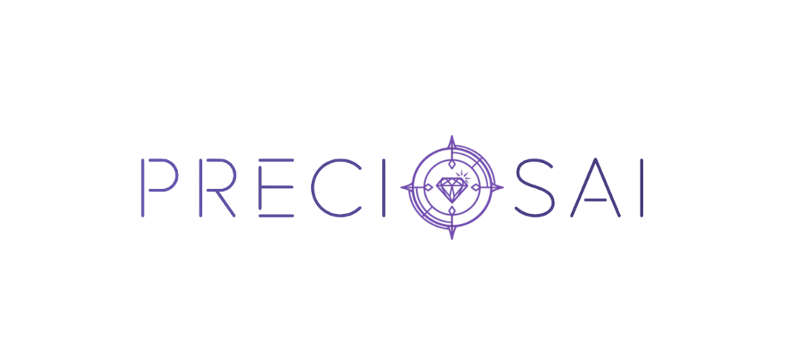
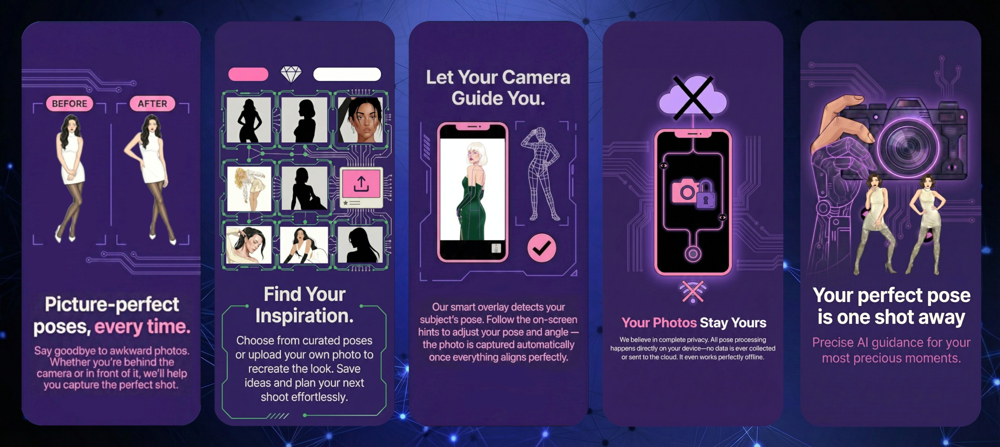

<div align="center">
  
  <p style="margin: 0; font-size: 200%;">
    Real-time photography app powered by AI
  </p>
</div>

---

## 💎 Introduction

**PreciosAI** is an open source high-performance Flutter application designed for intelligent photo capture and pose analysis. Leveraging a custom native Android plugin, it provides real-time neural scanning capabilities for highly accurate model pose recognition and matching, resulting in perfect, professional-looking photos.

<div align="center">
  
</div>


## ✨ Key Features

- **Immersive Neuro-Scanner**: A high-tech scanning interface that analyzes reference images to calibrate the AI for a precise photographing process.
- **Real-Time Recognition**: Instant on-device object detection and pose recognition using a native Kotlin implementation for maximum performance.
- **Similarity Matching**: Adjustable similarity algorithms, metrics and thresholds to achieve perfect alignment with your reference frames.
- **Advanced Camera Controls**:
  - **AI-Assisted Framing**: Automatic zoom adjustments help you capture the exact angle and composition required.
  - **Smart Shutter**: Automated capture triggers as soon as a perfect match is detected, ensuring you never miss a shot.
  - **Pro Controls**: Integrated support for Flash, Night Mode, and seamless camera switching.
- **Reference-Driven Gallery**: A built-in management hub to organize your captures and store reference inspirations for future sessions.
## 🛠 Tech Stack

- **Core & Languages**: Built with **Dart** (Flutter SDK ^3.8.1) and **Kotlin** (Android SDK) for a seamless cross-platform experience with deep native integration.
- **AI & Computer Vision**:
    - **Inference Engines**: **Google LiteRT** and **PyTorch ExecuTorch** for high-performance, on-device model execution.
    - **Image Processing**: **OpenCV** for advanced computer vision utilities and image manipulation.
    - **Models**: Specialized **YOLO** (Object Detection and Pose Estimation) and **RTMPose** (Pose Estimation) architectures.
- **Camera & Media**:
    - **Native Capture**: Powered by **Android CameraX** for robust, high-quality hardware access.
    - **Media Pipeline**: Integrated support for image picking, video playback, and audio feedback.
- **Native Architecture**: High-speed communication via **Flutter Platform Channels** and custom-built **Kotlin native modules**.
- **UI & Experience**:
    - **Animations**: **Lottie** (Android-native) for fluid, high-tech scanning visuals.
    - **Layout**: Dynamic, staggered gallery views with **Material Design** and **Google Fonts** typography.
- **Storage & Data**: Optimized file management using **Path Provider** and **Archive** for handling reference datasets and captured media.

## 📦 Getting Started

### Prerequisites

- Flutter SDK: `>=3.32.1`
- Android Studio / VS Code
- Android Device (Physical device recommended for camera/AI performance)

### Installation

1. **Clone the repository**:
   ```bash
   git clone https://github.com/empress-of-development/preciosAI.git
   cd preciosAI
   ```

2. **Install dependencies**:
   ```bash
   flutter pub get
   ```

3. **Run the app**:
   ```bash
   cd example
   flutter run
   ```

## ⚙️ Configuration

The app includes a settings panel accessible from the camera view where you can adjust:
- **Degree of similarity**: Controls how strictly the AI matches objects.
- **Resulting frames**: Defines how many candidate shots are captured during a scan.

---

<div align="center">
  <sub>Built with ❤️ and a pinch of madness by a nice girl</sub>
</div>
